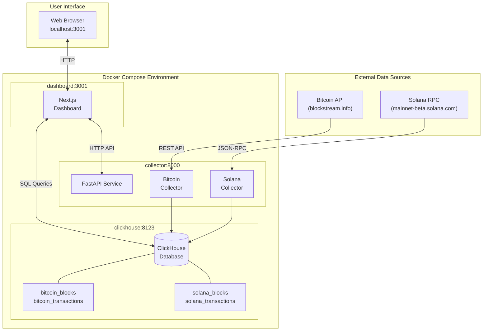

# Blockchain Data Ingestion with ClickHouse and Next.js

A complete, containerized system for ingesting blockchain data from **Bitcoin** and **Solana** into a local ClickHouse database. This educational project demonstrates a modern data engineering pipeline for blockchain analytics, featuring a FastAPI-based data collector and a real-time Next.js monitoring dashboard.

## What This Project Does

This system demonstrates real-time blockchain data engineering by collecting, storing, and analyzing data from Bitcoin and Solana networks. Students learn how to build data pipelines that process decentralized ledger data at scale using modern tools like FastAPI, ClickHouse, and Docker.

## Repository Structure

```
big_data_architecture/
├── README.md                           # Project overview and setup guide (this file)
├── docker-compose.yml                  # Service orchestration (ClickHouse, Collector, Dashboard)
├── .env.example                        # Environment configuration template
├── scripts/                            # Utility scripts
│   ├── start.sh                        # Quick start script (runs docker compose)
│   └── cleanup.sh                      # Complete teardown and data removal
├── docs/                               # Learning materials and references
│   ├── EXERCISES.md                    # Hands-on exercises (queries, analysis, challenges)
│   ├── GLOSSARY.md                     # Blockchain and data engineering terminology
│   └── SAMPLE_QUERIES.md               # ClickHouse SQL query examples
├── collector/                          # Python FastAPI data collection service
│   ├── main.py                         # FastAPI orchestration (start/stop/status API)
│   ├── collectors/
│   │   ├── bitcoin_collector.py        # Bitcoin data collection (blocks, transactions)
│   │   ├── solana_collector.py         # Solana data collection (slots, transactions)
│   │   └── data_validator.py           # Data quality validation (VERACITY)
│   ├── Dockerfile                      # Container image for collector service
│   └── requirements.txt                # Python dependencies
├── dashboard/                          # Next.js monitoring dashboard
│   ├── app/
│   │   ├── page.tsx                    # Main dashboard page
│   │   ├── components/                 # React components (charts, tables, controls)
│   │   ├── api/                        # API routes (data, status, start, stop)
│   │   └── lib/                        # ClickHouse client and utilities
│   ├── Dockerfile                      # Container image for dashboard service
│   └── package.json                    # Node.js dependencies
├── clickhouse-init/                    # Database initialization
│   └── 01-init-schema.sql              # Table schemas with compression codecs
└── data/                               # Persistent data storage (created at runtime)
    └── clickhouse/                     # ClickHouse data files
```

### Quick Navigation

**Getting Started:**
- Setup instructions: See "Getting Started" section below
- Configuration: See `.env.example` and "Configuration" section
- Start system: `./scripts/start.sh` or `docker compose up`
- Stop system: Press Stop button in dashboard or `docker compose down`
- Complete cleanup: `./scripts/cleanup.sh`

**Learning Resources:**
- Hands-on exercises: `docs/EXERCISES.md` (9 progressive exercises)
- Terminology reference: `docs/GLOSSARY.md` (blockchain and data concepts)
- Query examples: `docs/SAMPLE_QUERIES.md` (ClickHouse SQL patterns)

**Development:**
- Collector code: `collector/` directory (Python/FastAPI)
- Dashboard code: `dashboard/` directory (TypeScript/Next.js)
- Database schema: `clickhouse-init/01-init-schema.sql`
- API documentation: http://localhost:8000/docs (when running)
- Dashboard UI: http://localhost:3001 (when running)

**Data Access:**
- Dashboard: http://localhost:3001
- ClickHouse HTTP: http://localhost:8123 (username: default, password: clickhouse_password)
- Collector API: http://localhost:8000
- Direct queries: `docker compose exec clickhouse clickhouse-client --password clickhouse_password`

## Background

### Blockchain & Cryptocurrency Basics

**Blockchain** is a distributed ledger technology where data is stored in cryptographically linked blocks across a network of computers. Each block contains transactions, and once added to the chain, the data becomes immutable and transparent.

**Cryptocurrency** represents digital assets secured by blockchain technology. Instead of banks maintaining centralized ledgers, crypto networks use distributed consensus among thousands of nodes to validate and record transactions.

**Web3** refers to the vision of a decentralized internet built on blockchain technology, where users control their own data and assets without intermediaries. Blockchain data pipelines like this project enable analysis of Web3 activity, network health, and economic trends.

### Bitcoin: The Original Blockchain

Launched in 2009, **Bitcoin** is the first and most established blockchain network.

**Key Characteristics:**
- **Consensus:** Proof-of-Work (miners compete to solve cryptographic puzzles)
- **Block Time:** ~10 minutes per block (intentionally slow for security)
- **Transaction Model:** UTXO (Unspent Transaction Output) - tracks individual "coins" rather than account balances
- **Purpose:** Digital currency and store of value
- **Strengths:** Most secure and decentralized network with 15+ years of uptime

**Why Collect Bitcoin Data:**
Bitcoin's predictable block times and transparent UTXO model make it ideal for learning data engineering patterns. Transaction fees, mining difficulty, and block size trends reveal network congestion and adoption patterns.

### Solana: The High-Performance Blockchain

Launched in 2020, **Solana** is a modern blockchain designed for speed and scalability.

**Key Characteristics:**
- **Consensus:** Proof-of-History + Proof-of-Stake (cryptographic timestamps enable parallel processing)
- **Block Time:** ~400 milliseconds per slot (800x faster than Bitcoin)
- **Transaction Model:** Account-based with stateless programs
- **Purpose:** High-throughput applications (DeFi, NFTs, payments)
- **Strengths:** Capable of 65,000+ transactions per second with sub-second finality

**Why Collect Solana Data:**
Solana's high throughput generates massive data volumes quickly, making it perfect for testing data pipeline performance. The slot vs. block height distinction and transaction success/failure rates provide rich analytics opportunities.

### Why Compare Both Chains?

| Aspect | Bitcoin | Solana |
|--------|---------|--------|
| Block Time | ~10 minutes | ~400 milliseconds |
| Transactions/Block | 2,000-3,000 | 20,000+ |
| Consensus | Proof-of-Work | Proof-of-History + PoS |
| Data Volume | Moderate | High |
| Use Case | Store of value | High-speed applications |

Analyzing both chains demonstrates how different blockchain architectures affect data collection strategies, storage requirements, and query patterns.

## Learning Objectives

After completing this project, students will understand:

### 1. Big Data Fundamentals
- **The 5Vs Framework**: Volume, Velocity, Variety, Veracity, and Value with real blockchain examples
- **Real-Time Data Ingestion**: Continuous data collection patterns and streaming architectures
- **Columnar Storage**: Why ClickHouse outperforms row-based databases for analytical workloads
- **Data Compression**: Codec selection strategies (ZSTD, Delta, DoubleDelta) for different data types

### 2. Blockchain Concepts
- **Bitcoin UTXO Model**: How transactions reference unspent outputs instead of account balances
- **Solana Account Model**: State management with accounts and stateless programs
- **Consensus Mechanisms**: Proof-of-Work vs Proof-of-History + Proof-of-Stake trade-offs
- **Cross-Chain Analysis**: Comparing performance, security, and scalability across blockchains

### 3. Modern Data Stack
- **Docker Containerization**: Multi-service orchestration with Docker Compose
- **ClickHouse Database**: Schema design for time-series data and query optimization
- **FastAPI Backend**: Async Python for concurrent API calls and thread management
- **Next.js Dashboards**: Real-time visualization with Server Components and SWR
- **REST API Design**: Endpoint design, state management, and error handling

### 4. Data Engineering Skills
- **Schema Design**: Choosing ORDER BY columns, codecs, and engine types
- **Data Quality Validation**: Implementing VERACITY checks and logging anomalies
- **API Integration**: RPC protocols, rate limiting, retry logic, and error recovery
- **SQL Optimization**: Columnar query patterns, time-series aggregations, and partitioning
- **Performance Tuning**: Pagination strategies, client-side vs server-side rendering

## Features

- **Multi-Blockchain Support**: Simultaneously collects data from Bitcoin and Solana using free public RPC endpoints
- **High-Performance Ingestion**: Leverages FastAPI for asynchronous data collection and ClickHouse for fast, columnar data storage
- **Real-Time Dashboard**: Next.js dashboard with 7 metric cards showing Total Records, Data Size, **Ingestion Rate (records/sec)**, Bitcoin Blocks, Bitcoin Transactions, Solana Blocks, and Solana Transactions
- **Resilient Collection**: Automatic retry with exponential backoff for API failures, rate limits, and connection errors
- **Data Compression**: ZSTD compression with column-level codecs achieves 30-70% storage reduction for blockchain data
- **Health Monitoring**: Enhanced health check endpoint with per-blockchain metrics and error tracking
- **Containerized Deployment**: Complete Docker Compose orchestration for easy setup and portability
- **Fully Configurable**: All parameters managed through a single `.env` file
- **Safety Limits**: Automatic collection shutdown based on configurable time and data volume thresholds
- **Educational Focus**: Designed for teaching data engineering concepts with clear documentation and sample queries

## Recent Updates

### v1.2.0 (January 2026)
- Added real-time dashboard with Next.js 16 and Turbopack
- Implemented data preview tables with client-side pagination (10 rows/page)
- **Added Ingestion Rate metric showing records per second on dashboard**
- Fixed timestamp validation for auto-stop timer (UTC timezone handling)
- Added cache-control headers to prevent browser caching issues
- Improved error handling and state synchronization between components
- Enhanced table compression with optimized codecs

### v1.1.0 (January 2026)
- Migrated from Streamlit to Next.js dashboard for better performance
- Added countdown timer with automatic collection shutdown
- Implemented data quality verification table (VERACITY checks)
- Enhanced browser caching strategy with proper cache-control headers
- Reorganized repository structure for better student navigation

## System Architecture

The system consists of three containerized services orchestrated by Docker Compose:

| Service | Technology | Purpose |
|---------|-----------|---------|
| **ClickHouse Server** | ClickHouse | Columnar database for storing blockchain data with automatic schema initialization |
| **FastAPI Collector** | Python, FastAPI | Asynchronous data collection from blockchain RPC endpoints with REST API control |
| **Next.js Dashboard** | TypeScript, Next.js, React | Real-time monitoring interface with start/stop controls and performance metrics |

**Data Flow**: RPC Endpoints → FastAPI Collector → ClickHouse Database ← Next.js Dashboard

### Architecture Diagram



**How It Works:**

1. **Collection Phase**: The FastAPI collector service pulls data from Bitcoin and Solana RPC endpoints concurrently using async/await patterns
2. **Storage Phase**: Collected blocks and transactions are inserted into ClickHouse tables optimized for analytical queries
3. **Visualization Phase**: The Next.js dashboard queries ClickHouse for real-time metrics and displays interactive charts
4. **Control Phase**: Users can start/stop collection via the dashboard, which sends HTTP requests to the collector API

## Getting Started

### Prerequisites

Before starting, ensure you have:

**Required:**
- **Docker Desktop 20.10+** installed and running
  - Verify: `docker --version` and `docker compose version`
  - Download: https://www.docker.com/products/docker-desktop
- **10GB free disk space** (for Docker images and blockchain data)
  - Check: `df -h .` (Unix/macOS) or `dir` (Windows)
- **Internet connection** (for blockchain RPC API access)
- **Basic command line skills** (navigating directories, running commands, viewing logs)

**Recommended:**
- Basic SQL knowledge (SELECT, WHERE, GROUP BY, aggregations)
  - New to SQL? See "SQL Basics for Blockchain Data" section below
- Understanding of REST APIs and JSON data format
- Familiarity with Docker concepts (containers, images, compose)

**Time Expectations:**
- **First-time setup**: 15-20 minutes (Docker image downloads)
- **Subsequent starts**: 30-60 seconds
- **Core exercises** (1-6): 1.5-2 hours
- **Advanced exercises** (7-9): 1-1.5 hours
- **Extension challenges**: 2-3 hours

**System Requirements:**
- **Operating System**: macOS, Windows 10/11 with WSL2, or Linux
- **RAM**: 8GB minimum (16GB recommended for comfortable experience)
- **CPU**: 2+ cores recommended
- **Storage**: SSD preferred for ClickHouse performance

### Quick Start

**1. Clone or download this project**

```bash
git clone git@github.com:maruthiprithivi/big_data_architecture.git
cd blockchain-ingestion
```

**2. Configure environment variables** (optional for first-time users)

```bash
cp .env.example .env
```

**First-time users**: The defaults in `.env.example` work perfectly - no editing needed!
You can skip creating `.env` entirely and use `.env.example` as-is.

**To customize** (optional):
- `COLLECTION_INTERVAL_SECONDS=5`: How often to collect data (default: 5 seconds)
  - Increase to 10-30 if experiencing API rate limits
- `MAX_COLLECTION_TIME_MINUTES=10`: Auto-stop safety limit
  - Prevents accidental long-running collections in teaching environment
- `MAX_DATA_SIZE_GB=5`: Maximum data size before auto-stop
  - 5GB is enough for millions of transactions with ClickHouse compression
- `BITCOIN_ENABLED=true` / `SOLANA_ENABLED=true`: Enable/disable specific blockchains
  - Set to `false` to focus on one chain at a time

<!-- ETHEREUM: Commented out - uncomment when re-enabling
**Ethereum Note**: Disabled by default (requires free API key from Infura or Alchemy)
-->

See "Configuration Reference" section at the end for all available options.

**3. Start the system**

```bash
./scripts/start.sh
```

Or manually with Docker Compose:

```bash
docker compose up --build -d
```

**First-time setup**: 5-10 minutes (downloading Docker images ~2GB)
- You'll see: "Pulling clickhouse...", "Pulling collector...", "Pulling dashboard..."
- This is normal! Docker is downloading blockchain database and Python runtime images
- Progress bars will show download status

**Subsequent starts**: 30-60 seconds

**Success indicators:**
1. All services show "running":
   ```bash
   docker compose ps
   # STATUS column should show "Up" for all 3 services (clickhouse, collector, dashboard)
   ```

2. ClickHouse shows "healthy":
   ```bash
   docker compose ps clickhouse
   # STATUS should include "(healthy)" after ~30 seconds
   ```

3. Dashboard loads at http://localhost:3001
   - Should show "Collection Status" with "Stopped" indicator (this is correct!)

4. No error messages in logs:
   ```bash
   docker compose logs --tail=50
   # Look for INFO messages, not ERROR or CRITICAL
   ```

**If startup exceeds 15 minutes**, see Troubleshooting section below.

**What's happening during startup:**
- ClickHouse creates 8 database tables (bitcoin_blocks, solana_transactions, collection_metrics, etc.)
- Collector connects to blockchain RPC endpoints (Blockstream for Bitcoin, Solana mainnet)
- Dashboard starts Next.js web interface on port 3001

**4. Access the dashboard**

Open your browser and navigate to: **http://localhost:3001**

The dashboard displays 7 real-time metric cards:
1. **Total Records**: Aggregate count across all blockchains
2. **Data Size**: Storage used in ClickHouse (compressed)
3. **Ingestion Rate**: Records per second (average since collection started)
4. **Bitcoin Blocks**: Block count from Bitcoin blockchain
5. **Bitcoin Transactions**: Transaction count from Bitcoin
6. **Solana Blocks**: Block count from Solana blockchain
7. **Solana Transactions**: Transaction count from Solana

The **Ingestion Rate** metric provides real-time performance insights, showing the throughput of the data collection pipeline.

**5. Start collecting data**

Click the **"▶️ Start Collection"** button on the dashboard to begin ingesting blockchain data.

### Stopping the System

**Stop data collection:**

Click the **"⏹️ Stop Collection"** button on the dashboard.

**Shut down all services:**

```bash
docker compose down
```

**Complete cleanup (remove all data and start fresh):**

```bash
./scripts/cleanup.sh
```

The cleanup script provides an interactive, safe way to remove all deployed resources:
- Docker containers (clickhouse, collector, dashboard)
- Docker volumes (all collected blockchain data)
- Docker networks
- Local data directories
- Optional: Docker images (saves ~2GB but requires rebuild)

**Manual cleanup alternative:**

```bash
docker compose down -v
rm -rf data/clickhouse
```

**Important:** Both cleanup methods permanently delete all collected blockchain data. This action is irreversible.

## Configuration

All configuration is managed through the `.env` file. Key parameters include:

| Parameter | Default | Description |
|-----------|---------|-------------|
| `BITCOIN_RPC_URL` | `https://blockstream.info/api` | Bitcoin API endpoint |
| `SOLANA_RPC_URL` | `https://api.mainnet-beta.solana.com` | Solana RPC endpoint |
| `COLLECTION_INTERVAL_SECONDS` | `5` | Time between collection cycles |
| `MAX_COLLECTION_TIME_MINUTES` | `10` | Auto-stop after this duration |
| `MAX_DATA_SIZE_GB` | `5` | Auto-stop when data exceeds this size |
| `CLICKHOUSE_PASSWORD` | `clickhouse_password` | Database password |

**Note**: Public RPC endpoints may have rate limits. For production use, consider using dedicated RPC providers like Alchemy, Infura, or QuickNode.

## Data Dictionaries

The tables below define the schema for blockchain data collected by this system. Column descriptions provide context for each field, but for deeper explanations of blockchain concepts (UTXO, Merkle trees, Proof-of-History, etc.), see **[docs/GLOSSARY.md](docs/GLOSSARY.md)**.

### Bitcoin Tables

#### `bitcoin_blocks`

| Column | Type | Description |
|--------|------|-------------|
| `block_height` | `UInt64` | Sequential block number starting from genesis block (0). Increments by 1 for each mined block. Used as the primary identifier for blocks. |
| `block_hash` | `String` | Unique 256-bit SHA-256 hash of the block header. Serves as the block's cryptographic fingerprint and must meet difficulty target (start with certain number of zeros). |
| `timestamp` | `DateTime` | Unix timestamp when the miner created the block. Note: Can vary by up to 2 hours due to network time tolerance rules. |
| `previous_block_hash` | `String` | Hash of the preceding block in the chain. This cryptographic link creates the "chain" in blockchain and makes tampering detectable. |
| `merkle_root` | `String` | Root hash of the Merkle tree containing all transaction hashes. Enables efficient verification that a transaction exists in the block without downloading all transactions. |
| `difficulty` | `UInt64` | Mining difficulty target (higher = harder). Adjusts every 2,016 blocks (~2 weeks) to maintain ~10 minute average block time regardless of network hash power. |
| `nonce` | `UInt64` | 32-bit number miners increment when searching for a valid block hash. Typical blocks require billions of nonce attempts before finding a hash below the difficulty target. |
| `size` | `UInt32` | Block size in bytes, including all transaction data. Limited to ~1MB for non-witness data by network consensus rules. |
| `weight` | `UInt32` | SegWit block weight in units (max 4,000,000). Weights witness data (signatures) at 1 unit per byte vs. 4 units for transaction data, allowing more transactions per block. |
| `transaction_count` | `UInt32` | Total number of transactions included in the block. First transaction is always the coinbase (miner reward). Limited by `bitcoin_collector.py` to 25 transactions for API efficiency. |

#### `bitcoin_transactions`

| Column | Type | Description |
|--------|------|-------------|
| `tx_hash` | `String` | Unique 256-bit transaction identifier (double SHA-256 hash of transaction data). Used to reference this transaction in blockchain explorers and as input reference for spending. |
| `block_height` | `UInt64` | Height of the block containing this transaction. Foreign key relationship to `bitcoin_blocks.block_height`. |
| `block_hash` | `String` | Hash of the block containing this transaction. Provides additional link to parent block for verification. |
| `size` | `UInt32` | Transaction size in bytes (all data including inputs, outputs, and signatures). Affects fees since larger transactions cost more to process. |
| `weight` | `UInt32` | SegWit transaction weight in units (max 400,000 per transaction). Lower weight for witness data incentivizes SegWit adoption and enables more efficient block packing. |
| `fee` | `UInt64` | Transaction fee paid to miner in Satoshis (1 BTC = 100,000,000 Satoshis). Higher fees increase transaction priority. Calculated as: (sum of inputs) - (sum of outputs). |
| `input_count` | `UInt32` | Number of UTXOs (Unspent Transaction Outputs) consumed as inputs. Each input references a previous transaction output and includes a signature proving ownership. |
| `output_count` | `UInt32` | Number of new UTXOs created by this transaction. Outputs specify recipient addresses and amounts. One output typically represents "change" back to sender. |
| `timestamp` | `DateTime` | Timestamp of the block containing this transaction (inherited from `bitcoin_blocks.timestamp`). Note: Transaction creation time may differ from block time. |

### Solana Tables

#### `solana_blocks`

| Column | Type | Description |
|--------|------|-------------|
| `slot` | `UInt64` | Time-based slot number (~400ms intervals). Solana's primary block identifier. Sequentially assigned but not all slots produce blocks (leaders can miss their slot). Always increases. |
| `block_height` | `UInt64` | Confirmed block count (only successful blocks). Unlike slot numbers, block height has no gaps. Always ≤ slot number due to skipped slots. |
| `block_hash` | `String` | Unique hash identifier for this block. Derived from block contents and used to verify block integrity across the network. |
| `timestamp` | `DateTime` | Unix timestamp when the block was confirmed by the network. Derived from Solana's Proof-of-History clock, providing cryptographic proof of time ordering. |
| `parent_slot` | `UInt64` | Slot number of the previous block in the chain. Used to trace blockchain ancestry. The difference (slot - parent_slot) reveals how many slots were skipped. |
| `previous_block_hash` | `String` | Hash of the parent block, creating the cryptographic chain link. Essential for fork resolution and chain verification. |
| `transaction_count` | `UInt32` | Total transactions in this block/slot. Solana blocks can contain 20,000+ transactions due to parallel execution. Limited to 50 in `solana_collector.py` for API performance. |

#### `solana_transactions`

| Column | Type | Description |
|--------|------|-------------|
| `signature` | `String` | Base58-encoded Ed25519 transaction signature. Serves as the transaction ID in Solana (unlike Bitcoin where tx_hash is computed from contents). First signature is the fee payer. |
| `slot` | `UInt64` | Slot number containing this transaction. Foreign key to `solana_blocks.slot`. Transactions are ordered within slots for deterministic execution. |
| `block_hash` | `String` | Hash of the block containing this transaction. Provides link to parent block for verification and querying. |
| `fee` | `UInt64` | Transaction fee paid in Lamports (1 SOL = 1,000,000,000 Lamports). Fees are burned (destroyed) on Solana, not paid to validators, to create deflationary pressure. |
| `status` | `String` | Execution result: "success" or "failed". Solana charges fees for failed transactions (unlike Ethereum reverts). Failed transactions still consume compute units and occupy block space. |
| `timestamp` | `DateTime` | Timestamp of the block/slot containing this transaction (inherited from `solana_blocks.timestamp`). Reflects Proof-of-History clock time. |

### System Tables

#### `collection_metrics`

**Purpose:** Tracks performance metrics for each data collection cycle across all blockchain sources.

**Key Columns:**
- `metric_time`: Timestamp when the collection cycle completed
- `source`: Blockchain source identifier (e.g., "bitcoin", "solana")
- `records_collected`: Number of new records (blocks + transactions) inserted during this cycle
- `collection_duration_ms`: Time elapsed in milliseconds for this collection cycle (measures API latency + database insertion time)
- `error_count`: Number of errors encountered (network failures, RPC rate limits, parsing errors)
- `error_message`: Detailed error description if `error_count` > 0

**Usage:** Query this table to analyze collection throughput trends, identify slow APIs, detect error patterns, and monitor overall pipeline health. See Exercise 9 in docs/EXERCISES.md.

#### `collection_state`

**Purpose:** Maintains singleton state record tracking the collection process status and cumulative statistics.

**Key Columns:**
- `state_id`: Always 1 (single row table maintained by ReplacingMergeTree)
- `is_running`: Boolean flag indicating if collection is currently active (controlled via FastAPI `/start` and `/stop` endpoints)
- `total_records`: Cumulative count of all records collected across all sources since deployment
- `start_time`: Timestamp when the current collection session started
- `last_update`: Timestamp of the most recent state update
- `data_size_bytes`: Approximate total data volume collected (used for safety limit checks)

**Usage:** Dashboard queries this table to display collection status and enforce safety limits (MAX_COLLECTION_TIME_MINUTES, MAX_DATA_SIZE_GB). Updated after each collection cycle.

## Sample Queries

### Basic Exploration

**View latest Bitcoin blocks:**

```sql
SELECT block_height, timestamp, difficulty, transaction_count
FROM bitcoin_blocks
ORDER BY block_height DESC
LIMIT 10;
```

**Bitcoin transaction fee statistics:**

```sql
SELECT 
    min(fee) AS min_fee,
    max(fee) AS max_fee,
    avg(fee) AS avg_fee,
    median(fee) AS median_fee
FROM bitcoin_transactions;
```

**Solana success rate:**

```sql
SELECT 
    status,
    count() AS count,
    count() * 100.0 / sum(count()) OVER () AS percentage
FROM solana_transactions
GROUP BY status;
```

### Time-Series Analysis

**Bitcoin transaction volume by day:**

```sql
SELECT 
    toDate(timestamp) AS day,
    count() AS transaction_count,
    sum(fee) AS total_fees_satoshi
FROM bitcoin_transactions
GROUP BY day
ORDER BY day;
```

### Cross-Chain Comparisons

**Transaction throughput comparison:**

```sql
SELECT 'Bitcoin' AS chain, count() AS total_tx FROM bitcoin_transactions
UNION ALL
SELECT 'Solana' AS chain, count() AS total_tx FROM solana_transactions;
```

**Storage efficiency:**

```sql
SELECT 
    table,
    formatReadableSize(sum(bytes)) AS uncompressed,
    formatReadableSize(sum(bytes_on_disk)) AS compressed,
    round((1 - sum(bytes_on_disk) / sum(bytes)) * 100, 2) AS compression_pct
FROM system.parts
WHERE database = 'blockchain_data' AND active = 1
GROUP BY table;
```

For more comprehensive query examples, see **[docs/SAMPLE_QUERIES.md](docs/SAMPLE_QUERIES.md)**.

## Accessing the Database

### Using ClickHouse Client

Connect to the database from the command line:

```bash
docker compose exec clickhouse clickhouse-client --password clickhouse_password
```

### Using Python

```python
import clickhouse_connect

client = clickhouse_connect.get_client(
    host='localhost',
    port=8123,
    username='default',
    password='clickhouse_password',
    database='blockchain_data'
)

result = client.query("SELECT count() FROM bitcoin_blocks")
print(result.result_rows)
```

### Using HTTP Interface

```bash
curl -u default:clickhouse_password "http://localhost:8123/?query=SELECT+count()+FROM+bitcoin_blocks"
```

## Technology Stack

| Technology | Purpose | Documentation |
|------------|---------|---------------|
| **Python 3.11** | Programming language | [python.org](https://www.python.org/) |
| **FastAPI** | Async web framework for collector API | [fastapi.tiangolo.com](https://fastapi.tiangolo.com/) |
| **Next.js 15** | React framework for dashboard | [nextjs.org](https://nextjs.org/) |
| **TypeScript** | Type-safe JavaScript for frontend | [typescriptlang.org](https://www.typescriptlang.org/) |
| **ClickHouse** | Columnar OLAP database | [clickhouse.com](https://clickhouse.com/) |
| **Docker** | Containerization platform | [docker.com](https://www.docker.com/) |
| **clickhouse-connect** | Python client for ClickHouse | [GitHub](https://github.com/ClickHouse/clickhouse-connect) |
| **aiohttp** | Async HTTP client for RPC calls | [docs.aiohttp.org](https://docs.aiohttp.org/) |
| **SWR** | React hooks for data fetching | [swr.vercel.app](https://swr.vercel.app/) |
| **Recharts** | Charting library for React | [recharts.org](https://recharts.org/) |
| **Tailwind CSS v4** | Utility-first CSS framework | [tailwindcss.com](https://tailwindcss.com/) |

## API Endpoints

The FastAPI collector exposes the following endpoints:

| Endpoint | Method | Description |
|----------|--------|-------------|
| `/` | GET | API status and version |
| `/start` | POST | Start data collection |
| `/stop` | POST | Stop data collection |
| `/status` | GET | Get current collection status |
| `/health` | GET | Enhanced health check with per-blockchain metrics |

Access the interactive API documentation at **http://localhost:8000/docs** when the collector is running.

### Health Check Response

The `/health` endpoint provides detailed monitoring information:

```json
{
  "status": "healthy",
  "timestamp": "2026-01-05T12:00:00",
  "database": {
    "clickhouse": "connected",
    "query_latency_ms": "< 10"
  },
  "collection": {
    "active": true,
    "collectors": {
      "bitcoin": {
        "healthy": true,
        "last_collect": "2026-01-05T11:59:45",
        "seconds_since_collect": 15.2,
        "records_collected_5min": 26,
        "errors_5min": 0,
        "avg_duration_ms": 1250.5
      },
      "solana": {
        "healthy": true,
        "last_collect": "2026-01-05T11:59:58",
        "seconds_since_collect": 2.1,
        "records_collected_5min": 3050,
        "errors_5min": 0,
        "avg_duration_ms": 850.3
      }
    }
  },
  "enabled_blockchains": ["bitcoin", "solana"]
}
```

**Health Status Values:**
- `healthy`: All enabled collectors functioning normally
- `degraded`: One or more collectors experiencing errors or delays
- `unhealthy`: Database connection failure or critical error

**Use Cases:**
- Monitoring dashboards (Grafana, Datadog)
- Container orchestration health checks
- Automated alerting systems
- Performance analysis and debugging

## Performance & Reliability Improvements

This project includes several production-grade improvements for reliability and efficiency:

### Resilient API Collection

**Problem:** Public blockchain APIs can experience rate limits, timeouts, and temporary outages.

**Solution:** Implemented robust error handling with:
- **Exponential backoff**: Automatic retry with increasing delays (1s, 2s, 4s, 8s...)
- **Rate limit detection**: Recognizes 429 HTTP status codes and respects `Retry-After` headers
- **Graceful degradation**: Handles "block not found" errors (404) when trying to fetch blocks that haven't been mined yet
- **Connection pooling**: Reuses HTTP connections for efficiency
- **Timeout protection**: 10-second timeouts prevent hanging on slow APIs

**Result:** Bitcoin collection continues reliably despite Blockstream API's free tier limitations. Collection automatically recovers from transient failures without manual intervention.

**Files:**
- `collector/collectors/bitcoin_collector.py` - See `_api_call_with_retry()` method

### Data Compression

**Problem:** Blockchain data grows quickly, consuming significant storage (35MB+ for 390k Solana transactions uncompressed).

**Solution:** Enabled ZSTD compression with:
- **Server-level compression**: Configured in `config.xml` with 1MB threshold (reduced from default 10GB for educational datasets)
- **Column-level codecs**: Applied to all database columns
  - `CODEC(ZSTD(3))` for strings and general data
  - `CODEC(Delta, ZSTD(3))` for sequential numbers (block heights, timestamps)
- **Compression level 3**: Balanced performance vs. compression ratio

**Expected Results:**
- 30-50% compression for Bitcoin data (typical blockchain compression)
- 50-70% compression for Solana data (high-volume, repetitive transaction data)
- Transparent to queries (ClickHouse decompresses automatically)
- May improve query performance due to reduced I/O

**Note:** Compression only applies to new data. Old data (before restart) remains uncompressed until re-inserted.

**Files:**
- `data/clickhouse/preprocessed_configs/config.xml` - Server compression settings
- `clickhouse-init/01-init-schema.sql` - Column-level codecs

### Enhanced Health Monitoring

**Problem:** Difficult to diagnose collection issues without detailed metrics.

**Solution:** Enhanced `/health` endpoint with:
- Per-blockchain collection status
- Last collection timestamp and time elapsed
- Records collected in last 5 minutes
- Error counts and patterns
- Average collection duration (API latency + database insertion)
- Overall system health determination

**Use Cases:**
- Integration with monitoring tools (Prometheus, Datadog)
- Automated alerting (PagerDuty, Slack)
- Performance debugging
- Capacity planning

**Files:**
- `collector/main.py` - Enhanced `/health` endpoint

### Why Bitcoin Appears Slow

**Expected Behavior:**
- Bitcoin: ~6 blocks/hour (one every ~10 minutes by design)
- Solana: ~360 blocks/hour (constant stream, <1 second intervals)

Bitcoin's slow collection rate is intentional - it's the blockchain's design, not a bug. The 10-minute block time prioritizes security and decentralization over speed.

## Troubleshooting

### Container fails to start

Check logs for specific errors:

```bash
docker compose logs collector
docker compose logs clickhouse
docker compose logs dashboard
```

### RPC connection errors

Public RPC endpoints may be rate-limited or temporarily unavailable. The system now includes automatic retry logic, but you can also:
- Check the health endpoint for detailed error information: `curl http://localhost:8000/health`
- View collector logs for rate limit warnings: `docker logs blockchain-collector 2>&1 | grep -i "rate\|429"`
- Increase `COLLECTION_INTERVAL_SECONDS` in `.env` to reduce API pressure
- Use dedicated RPC providers (Alchemy, Infura, QuickNode) for production workloads
- Disable specific blockchains temporarily by setting `*_ENABLED=false`

**The collector now automatically handles:**
- Rate limits (429 errors) with exponential backoff
- Connection timeouts with retry logic
- "Block not found" errors (Bitcoin waiting for next block)

### Monitoring collection health

**Check system health:**
```bash
curl http://localhost:8000/health | jq
```

**View collection metrics:**
```bash
docker exec clickhouse clickhouse-client --query "
SELECT
    source,
    max(metric_time) as last_collect,
    sum(error_count) as errors,
    avg(collection_duration_ms) as avg_ms
FROM collection_metrics
WHERE metric_time > now() - INTERVAL 1 HOUR
GROUP BY source
"
```

**Check compression effectiveness:**
```bash
docker exec clickhouse clickhouse-client --query "
SELECT
    table,
    formatReadableSize(sum(bytes)) as uncompressed,
    formatReadableSize(sum(bytes_on_disk)) as compressed,
    round(100 - (sum(bytes_on_disk) / sum(bytes) * 100), 2) as saved_pct
FROM system.parts
WHERE database = 'blockchain_data' AND active
GROUP BY table
"
```

### Database connection errors

Ensure ClickHouse is fully initialized before the collector starts:

```bash
docker compose restart collector
```

### Dashboard shows no data

- Verify data collection has been started using the dashboard button
- Check collector logs: `docker compose logs collector`
- Query ClickHouse directly to verify data exists

## Educational Use Cases

This project is designed for teaching the following concepts:

1. **Data Engineering Pipelines**: Real-time data ingestion, transformation, and storage
2. **Blockchain Technology**: Understanding block structure and transaction data across different chains
3. **Database Design**: Columnar storage, partitioning, and compression in ClickHouse
4. **API Development**: RESTful APIs with FastAPI for service control
5. **Containerization**: Docker Compose for multi-service orchestration
6. **Data Visualization**: Real-time dashboards with Next.js and React
7. **SQL Analytics**: Complex queries for time-series and aggregate analysis
8. **Full-Stack Development**: TypeScript, React, Server Components, and API Routes

### The 5Vs of Big Data

This project demonstrates the **5Vs of Big Data** - the defining characteristics that make data "big":

| V | Definition | How This Project Demonstrates It |
|---|------------|----------------------------------|
| **Volume** | The sheer scale of data | Bitcoin's blockchain is ~500GB+. ClickHouse's columnar storage with 80-95% compression handles this efficiently. See partitioning by month. |
| **Velocity** | Speed of data generation and processing | Solana produces ~2.5 blocks/second vs Bitcoin's 1 block/10 min. Our async collectors handle both velocities concurrently. |
| **Variety** | Different data types and structures | Bitcoin (UTXO, REST API) vs Solana (accounts, JSON-RPC) <!-- vs Ethereum (EVM, JSON-RPC) -->. Each uses different data models unified into our schema. |
| **Veracity** | Data quality and trustworthiness | The `DataValidator` class validates blocks and transactions, checking completeness, accuracy, and consistency. Issues are logged to the `data_quality` table. |
| **Value** | Extracting meaningful insights | Dashboard analytics, SQL queries, and cross-chain comparisons turn raw blockchain data into insights about fees, throughput, and network health. |

#### Finding the 5Vs in the Code

Look for `[VOLUME]`, `[VELOCITY]`, `[VARIETY]`, `[VERACITY]`, and `[VALUE]` comments throughout the codebase:

- **main.py**: 5Vs framework overview and annotations in the collection loop
- **bitcoin_collector.py**: Module header explains how Bitcoin data exhibits each V
- **solana_collector.py**: Module header explains Solana's high-velocity characteristics
- **data_validator.py**: Complete implementation of VERACITY with quality checks
- **01-init-schema.sql**: The `data_quality` table tracks VERACITY metrics

## Limitations and Considerations

- **Public RPC Limits**: Free public endpoints have rate limits and may be unreliable
- **Data Completeness**: The system collects a subset of available blockchain data for educational purposes
- **Bitcoin Transactions**: Limited to 25 transactions per block due to API constraints
- **Solana Transactions**: Limited to 50 transactions per block for performance
- **Not Production-Ready**: This is an educational tool; production systems require additional error handling, monitoring, and security measures

## Future Development

The following features are planned for future releases:

### Ethereum Support
**Status:** CODE READY - Temporarily Disabled

<!-- ========================================
ETHEREUM: The code is fully implemented but commented out to focus on Bitcoin and Solana first.
See collector/collectors/ethereum_collector.py for the complete implementation.

To re-enable Ethereum:
1. Uncomment ethereum_collector.py (all 259 lines)
2. Uncomment Ethereum references in collector/main.py
3. Uncomment Ethereum tables in clickhouse-init/01-init-schema.sql
4. Set ETHEREUM_ENABLED=true in .env
5. Add valid Ethereum RPC URL with API key
======================================== -->

Ethereum data collection is fully implemented but temporarily disabled. Unlike Bitcoin and Solana, reliable Ethereum RPC access requires a paid API key from providers like Infura or Alchemy. We're focusing on Bitcoin and Solana first.

**Why Ethereum requires API keys:**
Free public Ethereum RPC endpoints are heavily rate-limited and unreliable. Educational institutions interested in Ethereum support can:
1. Sign up for free API keys at [Infura](https://www.infura.io/) or [Alchemy](https://www.alchemy.com/)
2. Uncomment Ethereum code (see instructions above)
3. Configure `ETHEREUM_ENABLED=true` in `.env`
4. Add your API key to `ETHEREUM_RPC_URL`

**Ethereum Schema Reference:**

<!-- Note: These tables are currently not created. Uncomment schema in 01-init-schema.sql to enable. -->

<details>
<summary>Click to view Ethereum table schemas</summary>

#### `ethereum_blocks`
| Column | Type | Description |
|--------|------|-------------|
| `block_number` | `UInt64` | Unique block number |
| `block_hash` | `String` | Block hash identifier |
| `timestamp` | `DateTime` | Block mining timestamp |
| `parent_hash` | `String` | Previous block hash |
| `miner` | `String` | Miner address |
| `difficulty` | `UInt64` | Mining difficulty |
| `total_difficulty` | `String` | Cumulative chain difficulty |
| `size` | `UInt32` | Block size in bytes |
| `gas_limit` | `UInt64` | Maximum gas allowed |
| `gas_used` | `UInt64` | Actual gas consumed |
| `transaction_count` | `UInt32` | Number of transactions |
| `collected_at` | `DateTime` | Data collection timestamp |

#### `ethereum_transactions`
| Column | Type | Description |
|--------|------|-------------|
| `tx_hash` | `String` | Transaction hash |
| `block_number` | `UInt64` | Block number |
| `block_hash` | `String` | Block hash |
| `from_address` | `String` | Sender address |
| `to_address` | `String` | Recipient address |
| `value` | `String` | Amount transferred (Wei) |
| `gas` | `UInt64` | Gas limit |
| `gas_price` | `String` | Gas price (Wei) |
| `nonce` | `UInt64` | Transaction nonce |
| `transaction_index` | `UInt32` | Position in block |
| `timestamp` | `DateTime` | Block timestamp |

</details>

### Other Planned Features
- Support for additional blockchains (Polygon, Avalanche, Arbitrum)
- Real-time WebSocket streaming for faster data collection
- Smart contract event parsing and indexing
- Data validation and quality checks
- Alerting for collection failures
- Materialized views for common queries
- Export data to Parquet files for long-term storage
- Authentication for the dashboard
- GraphQL API for flexible data querying

## License

This project is provided for educational purposes. Please ensure compliance with the terms of service of any RPC endpoints you use.

## References

- [Blockstream API Documentation](https://github.com/Blockstream/esplora/blob/master/API.md)
- [Solana RPC API Documentation](https://docs.solana.com/api/http)
- [ClickHouse Documentation](https://clickhouse.com/docs/en/intro)
- [FastAPI Documentation](https://fastapi.tiangolo.com/)
- [Next.js Documentation](https://nextjs.org/docs)
- [Docker Compose Documentation](https://docs.docker.com/compose/)

---

**Built for blockchain data education**
